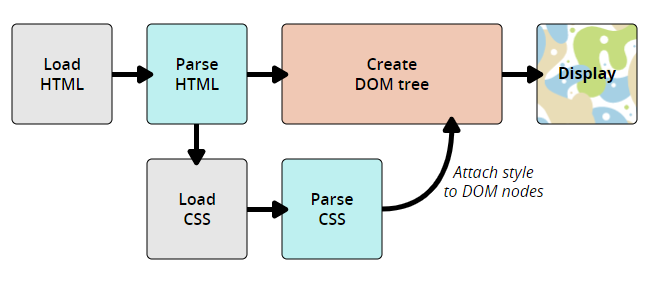

# 👩‍🚀 CSS Operation Flow?

- 브라우저가 문서를 표시할 때는 문서 내용과 스타일 정보를 결합해야 한다.



1. 브라우저가 HTML과 CSS를 DOM으로 변환한다. DOM은 컴퓨터 메모리에서 표현한 문서이다.
2. 브라우저가 DOM의 내용을 표시한다.

## About DOM
- DOM은 트리 구조를 가진다. Markup 언어의 각 element, 속성 및 텍스트는 트리 구조의 DOM 노드가 된다. 
- 노드는 다른 DOM 노드와의 관계로 정의한다.
- 일부 요소는 자식 노드의 부모이고, 자식 노드는 형제가 있다.
- DOM은 CSS와 문서의 content가 만나는 곳이기 때문에, DOM을 이해하는 건 CSS 디자인, 디버그, 유지관리에 도움이 된다.

### DOM Expression

```html
<p>
  써보자!
  <span>Cascading</span>
  <span>Style</span>
  <span>Sheets</span>
</p>
```
- DOM 에서 `<p>` 요소는 부모 노드이다.
- 자식 노드는 `써보자!`와 `<span>`요소가 해당한다.
- `<span>`요소는 `Cascading`,`Style`,`Sheets`의 텍스트 노드들의 부모노드이다.

즉, flow로 나타내자면
```
P
├─ "써보자!"
├─ SPAN
|  └─ "Cascading"
├─ SPAN
|  └─ "Style"
└─ SPAN
   └─ "Sheets"
```
- 이러한 tree 구조가 된다.


### Apply CSS to DOM

```html
<p>
  써보자!
  <span>Cascading</span>
  <span>Style</span>
  <span>Sheets</span>
</p>
```

```css
span {
  border: 1px solid black;
  background-color: lime;
}
```
- 브라우저는 HTML을 분석하고 DOM 트리를 생성한 후 CSS를 분석한다.
- CSS 규칙에 의해 `span` 선택자인 `<span>`에 속성과 값을 적용한다.

##### code run


## Apply CSS to HTML

### 외부 스타일 시트
- 외부 스타일 시트는 CSS를 `.css` 확장자의 별도 파일로 작성한 후 `<link>` element로 참조한다.

```html
<!DOCTYPE html>
<html>
  <head>
    <meta charset="utf-8">
    <title>My CSS experiment</title>
    <link rel="stylesheet" href="style.css">
  </head>
  <body>
    <h1>Hello World!</h1>
    <p>This is my first CSS example</p>
  </body>
</html>
```

```css
* style.css*
h1 {
  color: blue;
  background-color: yellow;
  border: 1px solid black;
}

p {
  color: red;
}
```

### 내부 스타일 시트
- 내부 스타일 시트는 외부에 CSS 파일을 두는 대신 HTML head안의 `<style>`요소에 작성한다.

```html
<!DOCTYPE html>
<html>
  <head>
    <meta charset="utf-8">
    <title>My CSS experiment</title>
    <style>
      h1 {
        color: blue;
        background-color: yellow;
        border: 1px solid black;
      }

      p {
        color: red;
      }
    </style>
  </head>
  <body>
    <h1>Hello World!</h1>
    <p>This is my first CSS example</p>
  </body>
</html>
```
- 내부 스타일 시트 방식은 CSS 파일을 직접 수정할 수 없는 환경에서 에서는 유용하지만, 외부 스타일 시트만큼 효율적이지 않다.

### Inline Style
- 하나의 요소에만 영향을 주는 CSS 선언문 목록으로 `Style` 속성 내부에 위치한다.

```html
<!DOCTYPE html>
<html>
  <head>
    <meta charset="utf-8">
    <title>My CSS experiment</title>
  </head>
  <body>
    <h1 style="color: blue;background-color: yellow;border: 1px solid black;">Hello World!</h1>
    <p style="color:red;">This is my first CSS example</p>
  </body>
</html>
```
- 이 방식은 유지보수에도 좋지 않으며 HTML의 구조적 정보와 CSS의 표현형 정보와 섞여서 읽고 이해하기도 안좋다.

