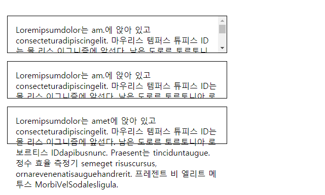
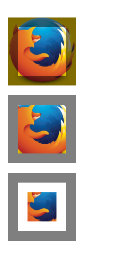
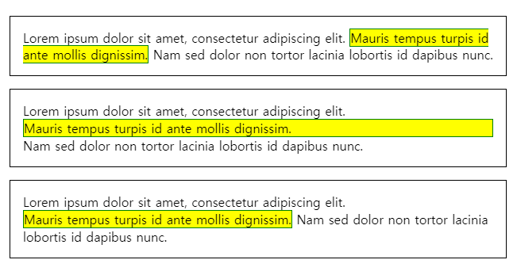

# 👨‍🔬 CSS Box Modeling

---
- CSS 상자 모델은 웹에서 레이아웃의 기초이다. 각 요소는 content, padding, margin등 서로 주위에 쌓여있는 사각형 상자로 표시된다.
- 브라우저는 웹 페이지 레이아웃을 렌더링 할 때 각 상자의 내용에 적용되는 스타일, 주변과 관련되어 있는 위치를 결정한다
---

## Box Attribute
- 문서 내의 모든 요소는 문서 레이아웃 내부의 사각형 상자로 구성되며, 특정 CSS 속성을 사용하여 크기와 레이아웃을 조정할 수 있다.


#### `width` and `height`
- `width`및 `height` 속성은 상자의 내용이 표시되는 영역인 content 상자의 폭과 높이를 설정한다.

#### `padding`
- `padding`은 content 상자의 바깥쪽 가장자리와 테두리 안쪽 가장자리 사이의 CSS 상자의 안쪽 여백을 의미한다.
- 4개의 면을 한번에 설정할 수 있고, `padding-top`, `padding-bottom`, `padding-right`, `padding-left`
로 각각 설정할 수 있다.

#### `border`
- `border` 속성은 padding의 바깥쪽 가장자리와 안쪽 가장 자리 사이에 위치한다.
- 기본적으로 `border`의 크기는 0으로 보이지 않지만 `border`의 두께, style 및 color를 설정하여 표시할 수 있다.

```css
border: 1px solid black;
```
- 위와 같이 `border` 속성은 한번에 4면에 설정 할 수 있다. 

-`border-top`, `border-bottom`, `border-rihgt`, `border-left` : 선택한 위치의 테두리의 두께, 스타일 및 색을 설정한다.

- `border-width`, `border-style`, `border-color` : 두께, 스타일, 색상만 개별적으로 설정하되, 모든 면에 설정한다.

- `border-top-width`,`border-top-style`,`border-top-color` : 테두리의 한 면에 3가지 특성 중 하나를 개별적으로 설정할 수 있다.

#### `margin`
- `margin`은 Box를 감싸고 레이아웃의 다른 box를 밀어 올린다.
- `margin`으로 모든 면에 여백을 설정할 수 있고, `margin-top`, `margin-right`,`margin-bottom`, `margin-left`로 각각에 여백을 줄 수 도 있다.

## Advanced Box Manipulation
- 상자의 너비, 높이, 테두리, 패딩 및 여백을 설정하는 것 외에도 상자의 동작 방식을 변경할 수 있는 다른 속성도 있다.

#### overflow
- 절대값을 사용하여 상자 크기를 설정할 때 content가 허용된 크기 내에 들어가지 않을 수 있다. 이러한 경우 발생하는 상황을 제어하기 위해 `overflow` 속성을 사용할 수 있다.
    - `auto` : content가 너무 많으면 `overflow`가 발생한 content가 숨겨지고 스크롤 막대가 나타나 사용자가 스크롤하여 모든 content를 볼 수 있다.
    - `hidden` : content가 너무 많으면 `overflow`가 발생한 content가 숨겨진다.
    - `visible` : content가 너무 많으면 `overflow`가 발생한 contents가 상자 외부에 표시된다. ( 일반적으로 기본 동작)

```css
p {
  width  : 400px;
  height : 2.5em;
  padding: 1em 1em 1em 1em;
  border : 1px solid black;
}

.autoscroll { overflow: auto;    }
.clipped    { overflow: hidden;  }
.default    { overflow: visible; }
```



## Background Clip
- 상자 배경은 색상과 이미지로 이루어져 있으며, 서로 겹쳐 있다.
- `background-color`, `background-image` 는 상자에 적용되고 그 상자 아래에 그려진다.
- 기본적으로 배경은 테두리의 바깥쪽 가장자리까지 확장된다.
- 상자에 `background-clip` 속성을 사용하여 조정할 수 있다.

```html
<div class="default"></div>
<div class="padding-box"></div>
<div class="content-box"></div>
```

```css
div {
  width  : 60px;
  height : 60px;
  border : 20px solid rgba(0, 0, 0, 0.5);
  padding: 20px;
  margin : 20px 0;

  background-size    : 140px;
  background-position: center;
  background-image   : url('https://mdn.mozillademos.org/files/11947/ff-logo.png');
  background-color   : gold;
}

.default     { background-clip: border-box;  }
.padding-box { background-clip: padding-box; }
.content-box { background-clip: content-box; }
```

##### Code Run



## Type of CSS Box 
- 지금까지 말한 모든 것이 block level element를 나타내는 상자에 적용된다.
- 요소에 적용되는 상자 유형은 `display` 특성에 의해 지정된다.
- `display` 에 값은 매우 다양하지만 일반적으로 `block`, `inline`, `inline-block`의 3가지를 사용한다.
    - `block` box는 다른 box에 쌓인 box로 정의되며 폭과 높이를 설정할 수 있다. 전체 box model이 block box에 적용된다.
    - `inline` box는 `block` box와 반대이다. 주변 text 및 다른 `inline` 요소와 같은 줄에 나타나고 그 내용은 문단의 text 흐름과 함께 끊어진다. 폭 및 높이 설정은 영향을 주지 않는다. `inline` box는 주변 텍스트의 위치를 update하지만 주위의 위치에는 영향을 주지 않는다.
    - `inline-block` box는 위의 2개의 속성 사이에 있는 것이다. 앞과 뒤에 줄뛰움을 만들지 않고 주위의 text와 다른 `inline` 요소들과 함께 적용된다. 

```css
p {
  padding : 1em;
  border  : 1px solid black;
}

span {
  border  : 1px solid green;
  /* That makes the box visible, regardless of its type */
  background-color: yellow;
}

.inline       { display: inline;       }
.block        { display: block;        }
.inline-block { display: inline-block; }
```

##### Code run


