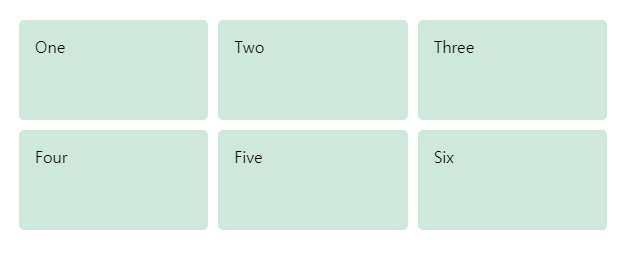

# 👧 CSS Layout 

---
- view port와 관련하여 상자를 올바른 위치에 배치하는 방법에 대해 공부한다.
- CSS Layout, 다양한 display 설정, CSS Grid, positioning등 최신 layout 도구를 자세히 살펴본다.
---

## Introduce CSS Layout
- CSS Page Layout 기술을 통해 웹 페이지에 포함된 요소를 가져와 기본 위치, 그 주변의 다른 요소, 상위 container 또는 view port 창에 상대적인 위치를 제어할 수 있다.
- 레이아웃 기술에는 아래와 같다.
    - Normal Flow
    - `display` property
    - Flex box
    - Grid
    - Floats
    - Positioning
    - Table Layout
    - Multiple - Column Layout

## Normal Flow
- `Normal Flow`는 사용자가 페이지 Layout을 제어하기 위해 하무것도 하지 않을때 브라우저가 기본적으로 HTML에 페이지를 표시하는 방법이다.

##### Example
```html
<p>I love my cat.</p>
    
<ul>
  <li>Buy cat food</li>
  <li>Exercise</li>
  <li>Cheer up friend</li>
</ul>
    
<p>The end!</p>
```

##### Code Run


- 위의 HTML을 보면 CSS를 설정하지 않아도 기본적으로 배치가 되어있다.
- CSS를 사용하여 레이아웃을 만들 때는 요소를 페이지의 많은 요소에 대해 필요한 Layout을 만든다.

- `display` property : `block`, `inline`과 같은 표준 값 아니면 `inline-block`요소는 일반적인 흐름에서 작동하는 방식을 변경할 수 있다.
- `Floats` : `float : left`와 같이 부동 값을 적용시키면 이미지 주변에 text가 떠 있는 방법과 같이 block level element가 요소의 한쪽 측면과 나란히 배열되도록 할 수 있다.
- `position` property : 다른 상자 내부의 상자 배치를 정확하게 제어할 수 있다. `static` 위치 지정은 기본 값이지만, 다른 값을 사용하여 요소를 다르게 배치할 수 있다.
- `Table Layout` : HTML 테이블의 요소 스타일을 지정하기 위해 설계된 기능을 `display : table`을 사용하여 테이블이 설정되어 있지 않은 요소에서 사용할 수 있다.
- `Multi - Column Layout` : 다중 열 레이아웃 속성은 블록 내용을 열로 배열 할 수 있다.

## The Display property
- CSS에서 페이지 레이아웃을 하는 주요 방법은 `display` 속성이다.
- 이 속성을 사용하면 기본적인 표시 방법을 변경할 수 있다.
- `display : block` : 이 설정은 영어로 된 단락 하나가 다른 단락을 아래에 표시한다.
- `display : inline` : 이 설정은 문단 내의 일부 텍스트를 중심으로 해당 텍스트를 나머지 텍스트와 `inline` 상태를 유지하며 새줄에 연결되지 않는다. 
- `<li>` 요소는 `display : block`을 기본적으로 표시된다. 이때 `display : inline`으로 속성을 변경하면 기본 표시 동작을 변경할 수 있다.

## Flex Box
- `flex box`는 `flexible box layout`의 짧은 이름으로 한줄 또는 열로 쉽게 물건을 배치 할 수 있도록 설계되었다.
- `display : flex` 로 사용할 수 있으며 부모에 추가하면 열로 정의된다.
- `flex-direction`의 초기 값은 `row`로 표시된다.
- `align-items` 속성의 초기값은 `stretch`로 가장 큰 항목의 높이까지 확장된다.
- 컨테이너 시작 부분에 모든 항목이 정렬되어 행 끝에 추가 공간이 남는다.

```html
<div class="wrapper">
  <div class="box1">One</div>
  <div class="box2">Two</div>
  <div class="box3">Three</div>
</div>
```

```css
.wrapper {
  display: flex;
}
```


- 플렉시블 컨테이너에 적용 할 수 있는 위 속성 외에도 플렉시블 항목에 적용할 수 있는 속성이 있다. 
- `flex  : 1 `값을 사용하여 모든 하위 항목에 속성을 추가할 수 있다. 이렇게 하면 끝에 공간을 남기지 않고 모든 항목으로 컨테이너를 채울 수 있다.

```CSS
.wrapper {
    display: flex;
}

.wrapper > div {
    flex: 1;
}
```


## Grid
- flexbox는 1차원 레이아웃을 위해 설계 되었지만 Grid Layout은 2차원으로 설계되어 있다.
- `display : grid`로 특정 표시값으로 grid layout을 사용 할 수 있다.
- 컨테이너와 일부 하위 요소가 있는 `flex` 예제와 유사한 markup을 사용한다.
- `display : grid `, `grid-template-rows` 및 `gird-template-columns` 속성을 사용하여 부모에 대한 일부 행 및 열을 정의 한다.


#### Example

```html
<div class="wrapper">
    <div class="box1">One</div>
    <div class="box2">Two</div>
    <div class="box3">Three</div>
    <div class="box4">Four</div>
    <div class="box5">Five</div>
    <div class="box6">Six</div>
</div>
```

```css
.wrapper {
    display: grid;
    grid-template-columns: 1fr 1fr 1fr;
    grid-template-rows: 100px 100px;
    grid-gap: 10px;
}
```

##### Code Run



- Grid가 있으면 위에 표시된 자동 배치 동작에 의존하지 않고 항목을 명시적으로 배치할 수 있다. 즉 개발자가 원하는 대로 배치 할 수 있다.
- `grid-column` 및 `grid-row` 속성을 사용하여 각 항목의 시작 및 끝을 설정할 수 있다.

#### Example
```html
<div class="wrapper">
    <div class="box1">One</div>
    <div class="box2">Two</div>
    <div class="box3">Three</div>
</div>
```

```css
.wrapper {
    display: grid;
    grid-template-columns: 1fr 1fr 1fr;
    grid-template-rows: 100px 100px;
    grid-gap: 10px;
}

.box1 {
    grid-column: 2 / 4;
    grid-row: 1;
}

.box2 {
    grid-column: 1;
    grid-row: 1 / 3;
}

.box3 {
    grid-row: 2;
    grid-column: 3;
}
```

##### Code Run


## Float
- 요소를 Floating하면 요소의 동작과 해당 요소를 따르는 block level element가 변경된다.
- 4가지 속성이 있는데
    - `left` : 요소를 왼쪽으로 띄운다.
    - `right` : 요소를 오른쪽으로 띄운다.
    - `none` : 기본값으로 위치를 지정하지 않는다.
    - `inherit - float ` : 속성 값이 요소의 부모 요소에서 상속되도록 지정한다.

#### Example
```html
<h1>Simple float example</h1>
    
<div class="box">Float</div>
    
<p> Lorem ipsum dolor sit amet, consectetur adipiscing elit. Nulla luctus aliquam dolor, eu lacinia lorem placerat vulputate. Duis felis orci, pulvinar id metus ut, rutrum luctus orci. Cras porttitor imperdiet nunc, at ultricies tellus laoreet sit amet. Sed auctor cursus massa at porta. Integer ligula ipsum, tristique sit amet orci vel, viverra egestas ligula. Curabitur vehicula tellus neque, ac ornare ex malesuada et. In vitae convallis lacus. Aliquam erat volutpat. Suspendisse ac imperdiet turpis. Aenean finibus sollicitudin eros pharetra congue. Duis ornare egestas augue ut luctus. Proin blandit quam nec lacus varius commodo et a urna. Ut id ornare felis, eget fermentum sapien.</p>
```

```css
.box {
    float: left;
    width: 150px;
    height: 150px;
    margin-right: 30px;
}
```

##### Code Run


## Position
- positioning을 사용하면 `noraml flow`에 배치된 위치에서 다른 위치로 이동 할 수 있다.
- `positioning`은 기본 페이지 레이아웃을 만드는 방법이 아니라 페이지에서 특정 항목의 위치를 관리하고 미세 조정하는 것이다.
- `position` 속성에 의존하는 특정 레이아웃 패턴에는 유용한 기술이 있다. positioning을 이해하면 `normal flow`와 `normal-flow`에서 벗어나게 하는 것이 무엇인지 이해할 수 있다.

1. `static` Positioning : 모든 요소가 가져 오는 기본 값이다. 즉, 문서 레이아웃 흐름에서 요소를 원래 위치레 놓는 것이다.
2. `relative` Positioning : 페이지에서 요소의 위치를 수정하여 페이지의 다른 요소와 겹치게 하는 등 요소를 이동 시킬 수 있다.
3. `absolute` Positioning : 요소를 별도의 layer에 있는 것처럼 페이지의 일반적인 레이아웃 흐름에서 완전히 벗어나게 한다. 
4. `flex` positioning : 다른 요소가 아니라 브라우저 뷰 포트를 기준으로 요소를 고정한다는 점을 제외하면 절대 위치와 매우 유사하다. 이 기능은 지속적인 content 탐색 메뉴와 같이 화면의 contents scroll과 같은 항상 같은 위치에 유지되는 효과를 만드는데 유용하다.
5. `sticky` positioning : `position : sticky`는 `position : flex`와 같이 뷰 포트에서 정의된 오프셋에 도달할때까지 요소가 작동하는 새로운 positioning 방법이다.