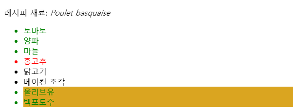
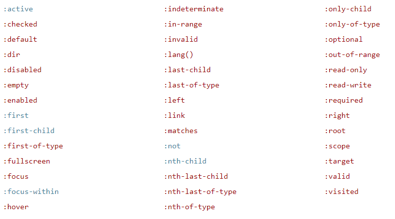

# 💂‍♀️ CSS_Selector

---
- CSS에서 선택자는 스타일을 적용하려는 웹 페이지의 HTML 요소를 고를때 사용한다.
- 다양한 종류의 CSS 선택자로 어떤 요소를 선택할 지 세밀하게 조절할 수 있다.
---

## Various Types of CSS Selector
- 단순 선택자 : `class`, `id`로 한 개 이상의 요소에 대응한다.
- 속성 선택자 : element 속성이나 속성 값에 따라 한 개 이상의 element에 대응한다.
- 의사 클래스 : 특정 상태로 존재하는 한 개 이상의 요소에 대응한다. 예를 들면 마우스 포인터를 올려 놓은 요소, 체크하거나 하지않은 체크박스등이 있다.
- 의사 요소 : 어떤 element 와 관련되어 특정 위치에 있는 한 개 이상의 내용에 대응한다. 예를 들면 매 문단 첫 번째 단어, 어떤 요소 바로 앞에 생성할 수 있는 내용등 이다.
- 결합자 : 실제 선택자는 아니고, 매우 상세한 선택을 하기 위해 두 개 이상의 선택자를 결합 할 수 있다. 예를 들어 `<div>`의 자손인 문단이나 제목 바로 다음으로 배치한 문단등이다.
- 다중 선택자 : 실제 선택자는 아니다. 한 개의 CSS 규칙에 여러 개의 선택자를 쉼표로 구분하여 정의하면 선택자들이 대응하는 모든 요소에 같은 규칙을 적용할 수 있다.

## 단순 선택자
- 단순 선택자는 문서 내 하나 이상의 요소를 요소 유형, `class`, `id`를 통해 선택한다.

### 유형 선택자
- 유형 선택자는 선택자와 주어지는 HTML 요소 이름이 같으면 선택한다.

```HTML
<p>무슨 색을 좋아하시나요?</p>
<div>저는 파랑을 좋아해요.</div>
<p>전 빨강이요!</p>
```

```CSS
/* 모든 p 요소는 빨강 */
p {
  color: red;
}

/* 모든 div 요소는 파랑 */
div {
  color: blue;
}
```

### 클래스 선택자
- 클래스 선택자는 마침표(`.`)와 뒤따르는 클래스 이름으로 이루어진다.
- 클래스 이름은 공백을 제외하고 HTML `class` 속성에 사용한 어떤 값이다.
- 문서 내 여러 요소에 같은 클래스를 부여할 수 있고, 한 개 요소에 여러 클래스 값을 공백으로 구분하여 부여할 수 있다.

```html
<ul>
  <li class="first done">HTML 문서 만들기</li>
  <li class="second done">CSS 스타일시트 만들기</li>
  <li class="third">서로 연결하기</li>
</ul>
```

```css
/* "first" 클래스를 가지면 굵게 */
.first {
  font-weight: bold;
}

/* "done" 클래스를 가지면 취소선 */
.done {
  text-decoration: line-through;
}
```

### ID 선택자
- ID 선택자는 해쉬(`#`)와 뒤따르는 ID 이름으로 이루어져있다.
- 어떤한 요소든 유일한 ID 이름을 `id` 속성에 지정할 수 있습니다.

```html
<p id="polite"> — "Good morning."</p>
<p id="rude"> — "Go away!"</p>
```

```css
#polite {
  font-family: cursive;
}

#rude {
  font-family: monospace;
  text-transform: uppercase;
}
```

### 공통 선택자
- 공통 선택자(`*`)는 조커 카드로, 페이지의 모든 요소를 선택한다.

```html
<div>
  <p>컨테이너가 그냥 <strong>테두리</strong>나 아무튼 <strong>뭐라도</strong>
  가지고 있는게 좋지 않을까 했는데,
  이건 <strong>통제를 벗어나고</strong> 있잖아!</p>
</div>
```

```css
* {
  padding: 5px;
  border: 1px solid black;
  background: rgba(255,0,0,0.25)
}
```

## 속성 선택자
- 속성 선택자는 요소의 속성에 따라 선택하는 특별한 선택자이다.
- 일반적인 구문은 대괄호(`[]`)와 그안의 속성 이름으로 이루어지며 선택적으로 속성 값에 따른 조건을 붙일 수 있다.
- 크게 존재와 값, 선택자와 부분일치 선택자로 나눌 수 있다.

### 존재와 값 속성 선택자
- `[attr]` : 속성이 `attr`이 존재하면 값과 상관없이 선택한다.
- `[attr=val]` : 속성 `attr`이 존재하되 값이 `val`이 되어야 한다.
- `[attr~=val]` : 속성 `attr`이 존재하되 공백으로 구분한 값 목록에 `val`이 있어야 선택한다.

```html
레시피 재료: <i lang="fr-FR">Poulet basquaise</i>
<ul>
  <li data-quantity="1kg" data-vegetable>토마토</li>
  <li data-quantity="3" data-vegetable>양파</li>
  <li data-quantity="3" data-vegetable>마늘</li>
  <li data-quantity="700g" data-vegetable="약간 매움">홍고추</li>
  <li data-quantity="2kg" data-meat>닭고기</li>
  <li data-quantity="선택사항 150g" data-meat>베이컨 조각</li>
  <li data-quantity="선택사항 10ml" data-vegetable="액체">올리브유</li>
  <li data-quantity="25cl" data-vegetable="액체">백포도주</li>
</ul>
```

```css
/* "data-vegetable" 속성을 가진 모든 요소는 초록색 */
[data-vegetable] {
  color: green;
}

/* "data-vegetable" 속성을 가지고,
   값이 "액체"면 배경 황금색 */
[data-vegetable="액체"] {
  background-color: goldenrod;
}

/* "data-vegetable" 속성을 가지고,
   "매움" 값이 목록에 들어가있으면 있으면 빨간색 */
[data-vegetable~="매움"] {
  color: red;
}
```



- `data-*` 속성은 데이터 속성이라 부르며 HTML에 사용자 설정 데이터를 저장하는 방법을 제공한다.

### 부분일치 속성 선택자
- 정규표현식과 비슷하게 유연한 선택을 제공하므로 "유사 정규표현 선택자"로도 알려져있다.
    - `[attr^=val]` : 속성 `attr`의 값이 `val`로 시작하면 선택.
    - `[attr$=val]` : 속성 `attr`의 값이 `val`로 끝나면 선택.
    - `[attr*=val]` : 속성 `attr`의 값이 부분 문자열 `val`을 포함하면 선택.

```css
/* 고전적인 언어 선택 */
[lang|="fr"] {
  font-weight: bold;
}

/* "data-quantity" 속성의 값이 "선택사항"으로 시작하는 경우 */
[data-quantity^="선택사항"] {
  opacity: 0.5;
}

/* "data-quantity" 속성의 값이 "kg"으로 끝나는 경우 */
[data-quantity$="kg"] {
  font-weight: bold;
}

/* "data-vegetable" 속성 값이 "약간 매움"을
   부분문자열로 포함하면 다시 초록색 */
[data-vegetable*="약간 매움"] {
  color: green;
}
```

## 의사 선택자
- 의사 선택자는 요소를 그냥 선택하지 않고, 요소의 일정 부분만 혹은 특정 상황에 처한 요소만 선택한다.

### 의사 클래스
- CSS의 의사 클래스는 선택자 뒤에 키워드를 추가하여 앞에 콜론(`:`)을 붙인다.
- 의사 클래스는 선택자로 선택한 요소가 특정 상황에 처해있어야 규칙을 적용하고 사용한다.



```html
<a href="https://developer.mozilla.org/" target="_blank">Mozilla Developer Network</a>
```

```css
/* 모든 상태의 링크에 적용 */
a {
  color: blue;
  font-weight: bold;
}

/* 방문한 링크와 방문하지 않은 링크에 같은 색 */
a:visited {
  color: blue;
}

/* 링크를 호버(마우스)하거나, 활성화 또는 선택(키보드)할 경우 강조 */
a:hover,
a:active,
a:focus {
  color: darkred;
  text-decoration: none;
}
```
### 의사 요소
- 의사 요소는 의사 클래스와 거의 똑같지만 다른 점도 있다. 키워드 앞에 콜론을 두개(`::`) 붙여야하며, 선택자와 일치하는 요소의 특정 부분을 선택한다.
- `::after`,`::before`,`::first0letter`,`::first-line`,`::selection`,`::backdrop` 등이 있다.

```html
<ul>
  <li><a href="https://developer.mozilla.org/en-US/docs/Glossary/CSS">CSS</a> defined in the MDN glossary.</li>
  <li><a href="https://developer.mozilla.org/en-US/docs/Glossary/HTML">HTML</a> defined in the MDN glossary.</li>
</ul>
```
```css
/* "href" 속성의 값이 "http"로 시작하면
   맨 끝에 외부 링크라는걸 알려주는 화살표를 추가 */
[href^=http]::after {
  content: '⤴';
}
```

## 결합자와 다중 선택자

### 결합자와 선택자 목록
- 한 번에 선택자 하나로도 유용하지만 일부 상황에선 효율적이지 않습니다. 
- CSS 선택자를 결합해 더 세부적인 조정을 하면 훨씬 유용한 결과를 얻을 수 있다.

|이름|구문|선택하는 요소|
|------|---|---|
|선택자 목록|A,B|A 혹은 B, 아니면 둘 다 만족하는 요소|
|하위 선택자|A B| A를 만족하는 요소의 자손 중 B를 만족하는 요소|
|자식 선택자|A>B|A를 만족하는 요소의 자식 중 B 를 만족하는 요소|
|인접 형제 선택자|A+B|A를 만족하는 요소의 바로 옆 형제면서 B를 만족하는 요소|
|일반 형제 선택자|A~B|A를 만족하는 요소의 다음 형제 중 B를 만족하는 요소|

### 하나의 규칙, 여럿의 선택자
- 선택자 여러 개를 쉼표로 구분해서 같은 규칙을 여러가지 요소에 적용 한다.

```CSS
h1, h2, h3, h4, h5, h6 {
  font-family: helvetica, 'sans serif';
}
```