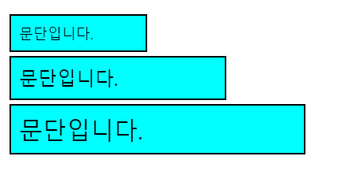
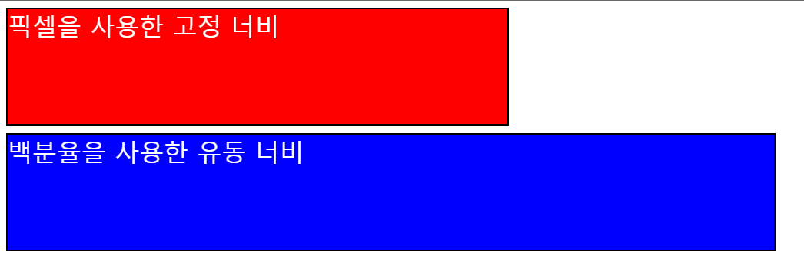

# 👮‍♀️ CSS Value and Units
---
- 숫자 값에서 색상, 복잡한 함수까지, CSS 속성의 값에는 고려해야 할 수 많은 값이 존재한다.

    - 숫자 값 : 요소 너비, 테두리 굵기, 글꼴 크기등 길이 값을 정할때나, 상대적인 줄 간격 높이, 애니메이션 재생 횟수 등 단위 없는 정수 값에 사용된다.
    - 백분율 : 부모 컨테이너의 너비나 높이에, 아니면 기본 글꼴 크기에 상대적으로 크기나 길이를 정할 수 있다.
    - 색 : 배경과 글꼴 색 등을 지정할 때 사용한다.
    - 함수 : 배경 이미지나 배경 그라데이션을 넣을 때 사용한다.
---
## 숫자 값

### 길이와 크기
- 레이아웃과 타이포그래피등 CSS에서 항상 쓰는 값이 길이/ 크기 단위이다.

```html
<p>문단입니다.</p>
<p>문단입니다.</p>
<p>문단입니다.</p>
```
```css
p {
  margin: 5px;
  padding: 10px;
  border: 2px solid black;
  background-color: cyan;
}

p:nth-child(1) {
  width: 150px;
  font-size: 18px;
}

p:nth-child(2) {
  width: 250px;
  font-size: 24px;
}

p:nth-child(3) {
  width: 350px;
  font-size: 30px;
}
```



- 모든 문단에 `margin`, `padding`, `border-width`을 각각 5픽셀, 10 픽셀, 2픽셀로 설정한다.
- 각 문단의 `width`를 점점 더 커지는 픽셀 값으로 설정한다.
- 각 문단의 `font-size`를 점점 더 커지는 픽셀 값으로 설정한다.

#### px
- 픽셀 (`px`)은 환경에 영향을 받지 않고 언제나 같은 크기를 가지기 때문에 절대 단위라고 불린다.

#### em
- 1em은 현재 요소의 `font-size`와 같다. 즉, `font-size`는 16픽셀이므로 1em의 기본값이 16px이다.
- 앞으로 가장 많이 사용할 상대 속성이 `em`이다.

#### vw, vh
- 각각 뷰포트 너비의 1/100, 뷰포트 높이의 1/100 입니다.

### 애니메이션 횟수
- CSS 애니메이션은 페이지의 HTML 요소를 움직이게 할 수 있다.

```HTML
<p>Hello</p>
```

```CSS
@keyframes rotate {
  0% {
    transform: rotate(0deg);
  }

  100% {
    transform: rotate(360deg);
  }
}

p {
  color: red;
  width: 100px;
  font-size: 40px;
  transform-origin: center;
}

p:hover {
  animation-name: rotate;
  animation-duration: 0.6s;
  animation-timing-function: linear;
  animation-iteration-count: 5;
}
```
- `animation-iteration-count` : 애니메이션이 시작한 후 재생할 횟수를 정하고 단위 없는 정수를 받는다.

### 백분율
- 특정 숫자 값을 받는 많은 속성은 백분율 값도 받을 수 있다.
- 백분율을 사용하는 예시중 하나로 언제나 부모 너비의 일정 비율을 차지하는 요소를 만들 수 있다.
- 반면 고정 단위값(`px`,`em` 등)은 부모의 너비가 변하더라도 처음 설정한 너비를 유지한다.

```html
<div>
  <div class="boxes">픽셀을 사용한 고정 너비</div>
  <div class="boxes">백분율을 사용한 유동 너비</div>
</div>
```

```css
div .boxes {
  margin: 10px;
  font-size: 200%;
  color: white;
  height: 150px;
  border: 2px solid black;
}

.boxes:nth-child(1) {
  background-color: red;
  width: 650px;
}

.boxes:nth-child(2) {
  background-color: blue;
  width: 75%;
}
```



- 예제는 두 상자(`<div>`) 모두에 `margin`, `height`, `font-size`,`border`,`color` 속성을 설정한다.
- 서로 구별하기 쉽게 `background-color`로 색을 다르게 입힌다.
- 첫번째 상자의 `width`는 650px로, 두 번째 너비를 75%로 지정한다.
- 이로 인해 뷰포트 크기가 달라져도 같은 너비를 유지하다가 화면이 얼정 너비보다 좁아지면 잘리기도 한다.
- 두번째 상자는 언제나 부모너비의 75%를 유지한다

---
## 함수

- 프로그래밍에서 함수한, 반복적인 작업을 개발자와 컴퓨터 양쪽 모두 최소한의 힘으로 계산 할 수 있도록 재사용하는 code 이다.
- CSS도 속성 값에 사용할 수 있는 함수를 갖고 있다.

```CSS
/* 45도 회전한 후의 위치를 계산 */
transform: rotate(45deg);
/* 옆으로 50픽셀, 아래로 60픽셀 이동한 후의 위치를 계산 */
transform: translate(50px, 60px);
/* 현재 너비의 90%에서 15픽셀을 뺀 값을 계산 */
width: calc(90% - 15px);
/* 배경으로 사용할 이미지를 네트워크에서 가져옴 */
background-image: url('myimage.png');
```