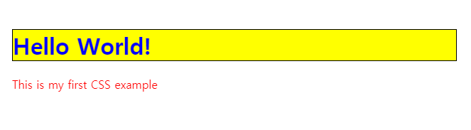

# 🤷‍♂️ What is CSS ?

- CSS는 스타일, 레이아웃 등을 통해 문서가 유저에게 어떻게 표시되는지를 지정하는 언어이다.
- 웹 브라우저는 CSS 규칙을 문서에 적용하여 어떻게 표출할지 영향을 준다.
- CSS 규칙은 아래와 같다.
    1. 속성 한 세트는 HTML contents가 표시되는 방법을 바꾸기 위한 값이다. 예를들어 요소의 너비를 부모의 절반(50%)으로, 배경은 빨갛게 할 수 있다.
    2. 하나의 선택자로 바꾼 속성 값을 적용할 요소를 선택한다.

## Example
- `<h1>`과 `<p>`를 포함한 단순한 HTML 문서를 예제로 만든다.
- 스타일 시트는 `<link>` 요소를 사용하여 HTML에 적용되었다는 것에 주목해야한다.

```HTML
<!DOCTYPE html>
<html>
  <head>
    <meta charset="utf-8">
    <title>My CSS experiment</title>
    <link rel="stylesheet" href="style.css">
  </head>
  <body>
    <h1>Hello World!</h1>
    <p>This is my first CSS example</p>
  </body>
</html>
```

```CSS
h1 {
  color: blue;
  background-color: yellow;
  border: 1px solid black;
}

p {
  color: red;
}
```

- 첫 번째 `h1` 선택자로 시작하는데, 이는 `<h1>` 요소에 자신의 속성 값을 적용하겠다는 것을 의미한다.
- 첫 번째 css 규칙 안에는 3개의 속성과 각각의 값이 있다.
    1. `color : blue;` : 글자색을 파랑색으로 만든다.
    2. `background-color : yellow;` : 배경을 노란색으로 만든다.
    3. `border : 1px solid black;` : 주위에 1px 굵기의 검은 테두리를 만든다.

- 두 번째 css 규칙은 `p` 선택자로 시작하는데 이는 `<p>` 요소에 자신의 속성 값을 적용하겠다는 것을 의미한다.
    1.`color : red;` : 글자색을 빨강색으로 만든다.

### code run



