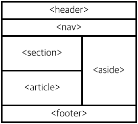

# ♻ Web Layout

## HTML Layout
- layout 이란, 특정 공간 안에 문자, 이미지등의 구성 요소를 보기 쉽게 효과적으로 배치하는 작업이다.
- HTML에서는 다음과 같은 방법으로 Layout을 작성한다.
    1. div 요소를 이용한 레이아웃
    2. HTML5 의미 요소를 이용한 레이아웃
    3. table 요소를 이용한 레이아웃



### div 요소를 이용한 레이아웃
- div 요소는 CSS 스타일을 손 쉽게 적용할 수 있으므로, Layout을 작성하는데 예전에는 자주 사용되었다. 현재는 HTML5의 Element가 추가된 레이아웃을 추천한다.

```html
<div id="header">Header</div>
<div id="nav">Nav</div>
<div id="section">
  Section
  <div id="article">Article</div>
</div>
<div id="aside">Aside</div>
<div id="footer">Footer</div>
```

### HTML5의 Element를 이용한 레이아웃
- HTML5에서는 웹 페이지의 레이아웃만을 위한 별도의 새로운 Element들을 제공한다.
- 이러한 element들을 의미(semantic) element라고 한다.
- semantic element는 기능은 없지만 의미를 명확하게 하여, 컴퓨터가 정보를 이해하고 논리적인 추론까지 할 수 있는 구조를 만들기 위해 추가된 tag이다.
- 검색 엔진 최적화 (SEO)를 할 시에 중요한 역할을 한다.

```HTML
<header>Header</header>
<nav>Nav</nav>
<section>
  Section
  <article>Article</article>
</section>
<aside>Aside</aside>
<footer>Footer</footer>
```

- `<header>` : HTML 문서나 section 부분에 대한 header를 정의함.
- `<nav>` : HTML 문서의 탐색 링크를 정의함.
- `<section>` : HTML 문서의 주요 content를 정의함.
- `<article>` : HTML 문서에서 section 부분을 정의함.
- `<aside>` : HTML 문서에서 독립적인 하나의 글 부분을 정의함.
- `<footer>` : HTML 문서에서 페이지 부분 이외의 content를 정의함.
