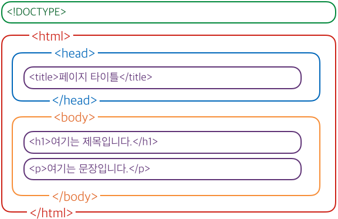
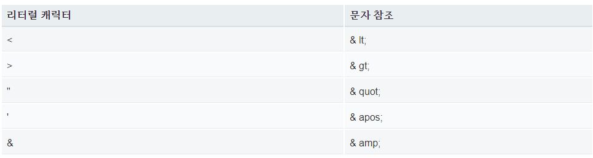

# 🧤 Structure of HTML Documents

## HTML 기본 구조

```html
<!DOCTYPE html>
<html>
  <head>
    <meta charset="utf-8">
    <title>My test page</title>
  </head>
  <body>
    <p>This is my page</p>
  </body>
</html>
```



1. `<!DOCTYPE html>` :  문서 형식을 나타낸다. 
2. `<html></html>` : <html> 요소이며 전체 페이지의 내용이다.
3. `<head></head>` : <head> 요소이며 CSS 스타일, 문자 집합 선언등 HTML 페이지의 모든 내용을 선택할 수 있다.
4. `<meta charset="utf-8">` : 이 요소는 문서에서 사용해야하는 문자 세트를 설정한다. `utf-8` 여기에는 대부분의 언어 문자가 포함된다. 이것을 설정하지 않으면 문제가 생길 수 있다.
5. `<title> </title>` : 페이지 제목을 설정한다. 페이지 제목은 페이지가 로드된 브라우저 tab에 표시되며 북마크/ 즐켜찾기에 추가하는데 사용된다.
6. `<body> </body>` : <body> 요소이며 여기에는 text, image, video, music등 웹 페이지를 방문 할 때 쉡 사용자에게 표시하려는 **모든 내용**이 포함된다.

## HTML 공백

```HTML
<p>Dogs are silly.</p>

<p>Dogs        are
         silly.</p>
```
- 위의 예제를 보면 많은 공백이 포함되어 있음을 알 수 있다.
- 하지만 HTML에서는 렌더링할때 각 공백을 줄이기때문에 브라우저에 보여지는 화면은 두 예제가 같은 결과물을 보여준다.
- 단, 개발자들에게 가독성을 위해 공백을 표기할 수 있다.

- 실행 화면 :
    <p>Dogs are silly.</p>

    <p>Dogs        are
            silly.</p>

> 참조 :
HTML에서 문자 `<`,`>`,`"`,`'` 및 `&`은 특수 문자 이다. 그렇게 때문에 이를 사용하기 위해서는 문자를 나타내는 특수 코드를 사용해야한다.



### Example
```html
<p>In HTML, you define a paragraph using the <p> element.</p>

<p>In HTML, you define a paragraph using the &lt;p&gt; element.</p>
```

- 실행 결과 : 

    <p>In HTML, you define a paragraph using the <p> element.</p>

    <p>In HTML, you define a paragraph using the &lt;p&gt; element.</p>

<p>

- 브라우저는 첫 번째 단락이 `<p>`로 새로운 단락을 시작한다고 생각하기 때문에 줄이 넘어간다. 두번째 단락은 문자 참조로 교체 했기 때문에 잘 출력된다.


