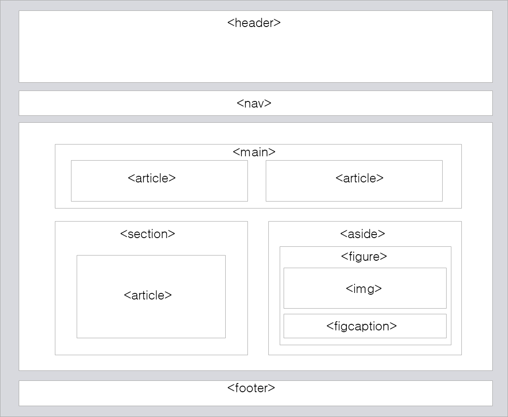

# 🚎 HTML5 Element

## 의미 요소 (semantic element)
- 의미 요소란 그 자체로 의미를 가지고 있는 요소를 가리킨다.
- 즉, 요소가 자기 스스로 브라우저와 개발자 모두에게 자신이 사용된 의미를 명확하게 전달해 주는 요소를 말한다.



## header element
- header element는 HTML 문서나 section 부분에 대한 header를 정의한다.
- header란 도입부에 해당하는 content를 가지고 있는 부분을 의미하는데 한 문서내에 여러 개의 header가 존재할 수 있다.

```html
<header>

    <h1>전체 문서에 대한 헤더(header)입니다.</h1>

</header>

...

<section>

    <header>

        <h2>섹션 부분에 대한 헤더(header)입니다.</h2>

        <p>헤더 부분에 들어간 단락입니다.</p>

    </header>

</section>
```

[실행결과](http://tcpschool.com/examples/tryit/tryhtml.php?filename=html5_element_semantic_01)

## nav element
- nav element는 HTML 문서 사이를 탐색할 수 있는 link의 집합을 정의한다.
- nav element는 link의 커다란 집합을 의미하지만, 문서 내의 모든 link가 nav element에 포함되는 것은 아니다.

```html
<nav>

    <a href="/html/html5_element_semantic">의미 요소</a> |

    <a href="/htmlhtml5_element_form/">Forms 요소</a> |

    <a href="/html/html5_element_inputtype">Input 요소</a>

</nav>

...

<p>이 링크는 nav 요소에 포함되지 않는 <a href="/html/html5_element_inputattr">Input 속성</a>에 관한 링크에요!</p>
```

[실행 결과](http://tcpschool.com/examples/tryit/tryhtml.php?filename=html5_element_semantic_02)

## section element
- section element는 HTML 문서에서 section 부분을 정의한다.
- section이란 제목을 가지고 있으며, HTML 문서의 전체적인 내용과 관련이 있는 contents 들의 집합을 의미한다.

```html
<section>

    <h2>섹션(section) 영역입니다.</h2>

    <p>Lorem ipsum</p>

</section>
```
[실행 결과](http://tcpschool.com/examples/tryit/tryhtml.php?filename=html5_element_semantic_03)

## article element
- article element는 HTML 문서에서 독립적인 하나의 article 부분을 정의한다.
- 그 자체만으로도 이해가 되어야하며, 웹 사이트의 나머지 부분과는 별도로 읽을 수 있어야 한다.

```html
<article>

    <h2>기사(article) 영역입니다.</h2>

    <p>Lorem ipsum</p>

</article>
```

[실행 결과](http://tcpschool.com/examples/tryit/tryhtml.php?filename=html5_element_semantic_04)

## section VS article
- 위의 예제로만 보면 section element와 article element 간의 별다른 차이점을 발견할 수 없다.
- 실제도로 두 element 간의 쓰임에 있어 큰 차이는 없지만 section element는 HTML 문서의 전체적인 내용에 포함되며, article element는 문서의 전체적인 내용과는 별도의 독립적인 내용이 들어갈 때 사용한다.

## footer element
- footer element는 HTML 문서나 section부분에 대한 footer를 정의한다.
- HTML 문서의 footer에는 일반적으로 사이트의 작성자나 그에 따른 저작권 정보, 연락처등을 명시한다.
- 한 문서 내에 여러 개의 footer 요소가 존재할 수 있다.

```html
<footer>

    <p>전체 문서에 대한 푸터(footer)입니다.</p>

    <p>Copyright 2016. 지은이 all rights reserved.</p>

    <p>연락처 : 02-1234-5678</p>

</footer>
```