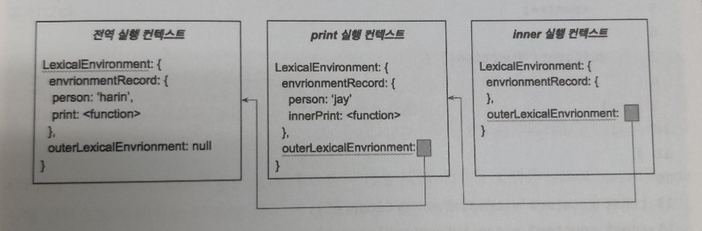

#JS_Scope

## 스코프 체인
- 스코프 체인을 이해하기 위해서는 먼저 실행 컨텍스트(Execution Context)와 렉시컬 환경(Lexical Environment)에 대해 알아야합니다.

## 실행 컨텍스트
- 코드가 실행되기 위해 필요한 정보를 가지고 있습니다.
- 실행 가능한 코드가 실행될때 생성됩니다.

~~~
var person = 'hosu';

function print(){
    var person2 = 'sinjung';

    function innerPrint(){
        console.log(person);
        console.log(person2);   
    }

    innerPrint();

    console.log('print finished');
}

print();
console.log('finish');
~~~

결과,
~~~
hosu
sinjung
print finished
finish
~~~

## 렉시컬 환경
- 환경 레코드(EnvironmentRecord)와 외부 렉시컬 환경(OuterLexicalEnviroment)로 구성됩니다.
- 실제 함수와 변수 같은 식별자와 그 식별자가 가리키는 값은 키(key)와 값의 쌍으로 환경 레코드에 기록됩니다. 
- 렉시컬 환경 레코드 외에 자신의 실행 환경을 감싸는 외부 실행 환경에 대한 참조를 가지고 있습니다.

- 각 실행 컨텍스트는 outerLexicalEnvironment로 체인처럼 연결되어 있습니다.

- 위의 예제로 살펴보면,
~~~
innerPrint 함수가 호출 될때 두 변수 person과 person2, 
즉 각 식별자는 연결된 값을 자신의 실행 컨텍스트의 렉시컬 환경에서 찾습니다.
하지만 person과 person2는 innerPrint 함수 내에 선언되지 않았습니다.
그러면 inner 실행 컨텍스트의 환경 레코드에는 아무런 key-value 쌍이 없게 됩니다.
이렇게 자신의 실행 컨텍스트에 없으면 외부 렉시컬 환경의 참조를 통해 연결된 print 실행 컨텍스트에서 해당 식별자를 찾게 됩니다.
이때 person을 print 실행 컨텍스트의 환경 레코드에서 찾아 'sinjung'을 출력하게 됩니다.
마찬가지로 person2는 전역 실행 컨텍스트까지 가서 찾아 값을 출력합니다.